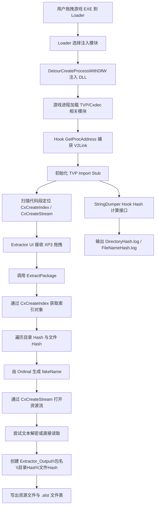

# XP3 纯哈希解包与纯哈希目录创建功能技术分析

## 1. 分析范围与结论先行

本文基于当前仓库源码，对“XP3 纯哈希文件解包”和“纯哈希文件夹创建”相关实现进行逐层分析。分析对象主要包括：

- `CxdecExtractorLoader`：负责把功能 DLL 注入游戏进程
- `CxdecExtractorUI`：负责拖拽 XP3 的交互入口
- `CxdecExtractor`：负责定位游戏内部接口、读取文件表、创建资源流、落盘输出
- `CxdecStringDumper`：负责在游戏运行期记录“字符串 -> Hash”映射

先给出三个关键结论：

1. 当前仓库**已经实现**“单个 XP3 纯哈希解包”和“纯哈希目录结构创建”。
2. 当前仓库**没有真正实现**“多 XP3 批量拖拽解包”。UI 代码只读取拖入列表的第一个文件，README 也明确写明“不支持，仅支持单个封包逐个拖拽提取”。
3. 当前仓库**没有实现**“把纯哈希目录自动还原为明文目录/文件名”的后处理流程；它只是额外提供了 `CxdecStringDumper`，用于在游戏运行时抓取目录名和文件名的 Hash 映射，为后续人工或外部工具还原命名提供基础数据。

## 2. 能力边界校验

| 能力项 | 当前状态 | 代码依据 |
| --- | --- | --- |
| 单个 XP3 解包 | 已实现 | `CxdecExtractor/ExtractCore.cpp` |
| 纯哈希目录创建 | 已实现 | `CxdecExtractor/ExtractCore.cpp` 中 `dirHash/fileNameHash` 路径拼接 |
| 纯哈希 `.alst` 文件表输出 | 已实现 | `CxdecExtractor/ExtractCore.cpp` |
| 多文件批量拖拽解包 | 未实现 | `CxdecExtractorUI/dllmain.cpp` 仅调用 `DragQueryFileW(..., 0, ...)` |
| 运行时目录名/文件名 Hash 映射采集 | 已实现 | `CxdecStringDumper/HashCore.cpp` |
| 自动按映射重命名已解包结果 | 未实现 | 仓库内无对应模块 |

这一点非常重要：如果从产品需求角度谈“批量解包 XP3 纯哈希文件”，那么当前实现更准确的描述应该是：

> 核心解包器具备“可重复调用”的能力，但现有 UI 入口只支持一次处理一个 XP3。

也就是说，**解包内核可复用，批量调度层未完成**。

## 3. 整体架构

### 3.1 架构角色

| 模块 | 职责 |
| --- | --- |
| `CxdecExtractorLoader` | 启动游戏并注入解包/Hash 采集 DLL |
| `CxdecExtractorUI` | 创建拖拽窗口，接收 XP3 文件并调用导出函数 `ExtractPackage` |
| `CxdecExtractor` | 在游戏进程内定位 Cxdec/Hxv4 内部接口，读取索引并提取资源 |
| `CxdecStringDumper` | Hook 游戏内部 Hash 计算接口，记录明文字符串与 Hash 的对应关系 |
| `Common` | 提供路径、目录、日志、文件、PE 特征搜索等基础能力 |

### 3.2 端到端流程图



## 4. 实现原理

### 4.1 为什么不是“静态解析 XP3”，而是“借用游戏自己的解包接口”

本项目的核心思路，不是自己完整逆向并重写 Hxv4/Cxdec 的封包规则，而是：

1. 把 DLL 注入到**已经载入了正确引擎环境**的游戏进程中。
2. 在运行时定位游戏内部的 `CxCreateIndex` 和 `CxCreateStream`。
3. 直接调用游戏原生逻辑获取索引与资源流。

这样做的最大好处是：

- 不必在工具侧完整复刻 Cxdec 的索引解析与解密逻辑。
- Hash、Key、加密模式等细节都由游戏原始实现处理，工具只做“调度、读取、落盘”。
- 对“纯哈希封包”尤其有效，因为真实文件名本来就不在封包里，静态解析器就算读到索引，也拿不到明文路径。

### 4.2 注入与接口定位原理

`CxdecExtractorLoader` 使用 `DetourCreateProcessWithDllW` 启动目标 EXE，并把 `CxdecExtractorUI.dll` 或 `CxdecStringDumper.dll` 注入新进程。其本质是“启动时注入”，而不是在目标进程运行后再附加。

核心代码路径：

- `CxdecExtractorLoader/CxdecExtractorLoader.cpp`
- `CxdecExtractor/Application.cpp`
- `Common/pe.cpp`

定位内部接口的方式分两层：

1. **Hook `GetProcAddress`**：等待目标模块请求 `V2Link` 导出，说明 TVP 插件体系已经开始初始化。
2. **扫描代码段特征码**：在代码段中搜索 `CreateStreamSignature` 与 `CreateIndexSignature`，定位 `CxCreateStream` / `CxCreateIndex` 的真实地址。

这是一种典型的“运行时签名定位 + 最小侵入调用”的逆向工程方案。

### 4.3 关键数据结构

#### 4.3.1 `FileEntry`

`CxdecExtractor/ExtractCore.h` 中定义了核心记录结构：

- `DirectoryPathHash[8]`：目录路径 Hash，固定 8 字节，最终输出为 16 位十六进制字符串
- `FileNameHash[32]`：文件名 Hash，固定 32 字节，最终输出为 64 位十六进制字符串
- `Key`：打开资源流时所需的文件级 Key
- `Ordinal`：复合字段，既包含伪文件名编码基础，也包含加密模式信息

其中两个辅助方法很关键：

- `GetEncryptMode()`：从 `Ordinal` 的 32-47 位提取加密模式
- `GetFakeName()`：把 `Ordinal` 的低 32 位编码成资源伪文件名

#### 4.3.2 索引对象的逻辑结构

`CxCreateIndex` 返回的是一个 TJS `Variant` 对象，而不是 C++ 里已经定义好的强类型结构。当前代码按“数组对”的方式去解释它：

```text
顶层目录数组:
  [ dirHashOctet, fileEntriesArray, dirHashOctet, fileEntriesArray, ... ]

子文件数组:
  [ fileHashOctet, fileInfoArray, fileHashOctet, fileInfoArray, ... ]

fileInfoArray:
  [ ordinal, key ]
```

因此其逻辑结构可以抽象为：

```text
Map<DirHash, List<(FileHash, {Ordinal, Key})>>
```

这也是“纯哈希识别”的关键依据：**索引里暴露的是 Hash Octet，而不是明文路径字符串。**

#### 4.3.3 `IStringHasher` 与 `CompoundStorageMedia`

`CxdecStringDumper/HashCore.h` 中对游戏内部对象做了逆向建模：

- `IStringHasher`：目录/文件名 Hash 计算接口
- `PathNameHasher`：目录路径 Hash 对象，含 16 字节盐
- `FileNameHasher`：文件名 Hash 对象，含 32 字节盐
- `CompoundStorageMedia`：Cxdec 的存储介质管理对象，持有 Hash Seed、PathNameHasher、FileNameHasher

这里的重点不是“自己算 Hash”，而是**在运行期抓游戏本来的 Hash 计算结果**。

### 4.4 “纯哈希文件”的识别原理

当前仓库里并没有一个显式的 `IsPureHashArchive()` 函数，识别过程是**隐式结构识别**：

1. 用户拖入一个 XP3 文件名。
2. `ExtractPackage()` 构造标准存储名并调用 `CxCreateIndex`。
3. 如果返回对象类型是 `tvtObject`，则按目录项/文件项结构遍历。
4. 每个目录项读取到的是 `tTJSVariantOctet* dirHash`。
5. 每个文件项读取到的是 `tTJSVariantOctet* fileNameHash`。
6. 索引中没有明文目录名和明文文件名，输出时只能使用 Hash。

因此，从源码角度更准确的说法是：

- 工具并不是先“判断一个 XP3 是否纯哈希”，再进入专门分支；
- 而是直接按 Cxdec/Hxv4 的索引结构取值；
- 由于拿到的字段天然就是目录 Hash 与文件 Hash，所以最终落盘结果必然是纯哈希目录树。

如果 `CxCreateIndex` 返回空、类型不对、或没有任何条目，则工具直接弹出“请选择正确的XP3封包”。

### 4.5 `Ordinal -> fakeName` 的生成算法

`CreateStream` 并不是通过真实文件名打开资源，而是通过“封包名 + fakeName + key + encryptMode”访问目标流。

`fakeName` 的生成方式如下：

```cpp
unsigned __int32 ordinalLow32 = this->Ordinal & 0x00000000FFFFFFFFi64;
do
{
    unsigned __int32 temp = ordinalLow32;
    temp &= 0x00003FFFu;
    temp += 0x00005000u;
    fakeName[charIndex] = temp & 0x0000FFFFu;
    ++charIndex;
    ordinalLow32 >>= 0x0E;
} while (ordinalLow32 != 0u);
```

可以把它理解成：

1. 取 `Ordinal` 的低 32 位。
2. 每次提取 14 bit。
3. 给这 14 bit 加上 `0x5000` 偏移，映射到一个宽字符。
4. 最多生成 3 个宽字符，组成资源伪名。

这个伪名不是用户可读文件名，而是**游戏内部访问封包成员时使用的名字**。当前工具通过这个伪名，配合 `Key` 与 `EncryptMode`，复用引擎自己的打开逻辑。

### 4.6 资源流创建原理

`CreateStream()` 的核心流程：

1. 用 `GetFakeName()` 生成伪文件名。
2. 拼成 `游戏路径 + 包名 + ">" + fakeName`。
3. 调用 `TVPNormalizeStorageName()` 规范化存储路径。
4. 使用 `CxCreateStream(tjsArcPath, key, encryptMode)` 打开资源流。

这说明解包器没有自己理解 XP3 包内部偏移，而是直接向引擎请求一个**已经能读取正确内容的 `IStream`**。

### 4.7 纯哈希文件夹创建原理

真正创建“纯哈希文件夹”的逻辑非常直接：

```cpp
std::wstring dirHash = StringHelper::BytesToHexStringW(entry.DirectoryPathHash, sizeof(entry.DirectoryPathHash));
std::wstring fileNameHash = StringHelper::BytesToHexStringW(entry.FileNameHash, sizeof(entry.FileNameHash));
std::wstring arcOutputPath = extractOutput + L"\\" + dirHash + L"\\" + fileNameHash;
```

其中：

- `DirectoryPathHash[8]` 被编码为 16 位十六进制字符串，作为目录名
- `FileNameHash[32]` 被编码为 64 位十六进制字符串，作为文件名

随后在 `ExtractFile()` 里：

1. 取 `extractPath` 的目录部分
2. 调用 `Directory::Create(outputDir)`
3. `Directory::Create()` 递归创建上层路径

因此，最终输出目录结构形如：

```text
游戏目录\Extractor_Output\包名\目录Hash\文件Hash
```

示意例子：

```text
Extractor_Output\data\12AB34CD56EF7890\9F0A...64位十六进制...
```

### 4.8 `.alst` 文件表的意义

解包时还会在 `Extractor_Output` 下输出一个与包同名的 `.alst` 文件，例如：

```text
Extractor_Output\data.alst
```

每条记录格式为：

```text
dirHash##YSig##dirHash##YSig##fileHash##YSig##fileHash
```

这里目录 Hash 和文件 Hash 都各写了两次。结合字段重复形式，可以推断它是为了兼容某种“原名/目标名”双字段文件表格式，但在“纯哈希”场景下没有可恢复的明文名，因此当前实现只能把两侧都填成 Hash 自身。

这是一个很有代表性的设计：**先保证解包结果可管理、可追踪、可与后续工具链对接，再谈命名恢复。**

### 4.9 文本资源的特殊解密原理

解包并不是单纯把流原样写出。`ExtractFile()` 会先调用 `TryDecryptText()` 识别并处理简单文本加密。

识别头：

- 前 2 字节必须是 `FE FE`
- 第 3 字节是 `mode`
- 接下来必须是 `FF FE`，也就是 UTF-16LE BOM

支持三种模式：

#### 模式 0

对每个宽字符执行：

```cpp
if (ch >= 0x20) buffer[i] = ch ^ (((ch & 0xfe) << 8) ^ 1);
```

#### 模式 1

对每个宽字符做奇偶位交换：

```cpp
ch = ((ch & 0xaaaaaaaa) >> 1) | ((ch & 0x55555555) << 1);
```

#### 模式 2

先读取：

- `compressed`：压缩长度
- `uncompressed`：解压后长度

再用 `ZLIB_uncompress` 解压，最后在输出缓冲前补回 UTF-16LE BOM。

如果文本识别失败，工具会退回普通二进制流完整读取路径。

## 5. 实现步骤

下面按执行顺序梳理完整流程。

### 步骤 1：启动 Loader 并注入目标 DLL

1. 用户把游戏 EXE 拖到 `CxdecExtractorLoader.exe`。
2. Loader 解析命令行拿到目标游戏路径。
3. 用户在对话框中选择“加载解包模块”或“加载字符串Hash提取模块”。
4. Loader 调用 `DetourCreateProcessWithDllW()`，创建带注入 DLL 的游戏进程。

### 步骤 2：等待 TVP/Cxdec 初始化

1. 注入 DLL 进入进程后，在 `DllMain` 中初始化单例。
2. 通过 Detours Hook `GetProcAddress`。
3. 当目标模块请求 `V2Link` 时，说明 TVP 插件体系开始可用。
4. 先 Hook 一次 `V2Link`，在真正调用后执行 `TVPInitImportStub(exporter)`。

这样做是为了保证后续调用 `TVPGetAppPath()`、`TVPNormalizeStorageName()` 等 TVP API 时环境已经准备好。

### 步骤 3：扫描代码段定位核心接口

1. 取得模块 PE 头。
2. 取第一个节表项对应的代码段地址和大小。
3. 用 `PE::SearchPattern()` 搜索：
   - `CreateStreamSignature`
   - `CreateIndexSignature`
4. 找到后保存到：
   - `mCreateStreamFunc`
   - `mCreateIndexFunc`

一旦定位完成，会撤销对 `GetProcAddress` 的 Hook，减少后续运行期开销。

### 步骤 4：用户拖入 XP3，进入解包入口

`CxdecExtractorUI` 创建了一个支持 `WM_DROPFILES` 的窗口。当前实现只做了：

```cpp
DragQueryFileW(hDrop, 0u, fullName, MaxPath)
```

这意味着：

- 只读取拖入列表的第一个文件
- 没有遍历拖入项数量
- 因而 UI 层面不是批量解包

之后代码取 `PathFindFileNameW(fullName)`，只把文件名传给 `ExtractPackage()`。这又带来一个隐含约束：

- XP3 必须位于游戏目录中，或者至少游戏目录里存在同名 XP3
- 因为传入解包核心的是文件名，不是绝对路径

### 步骤 5：读取索引并识别纯哈希结构

1. `ExtractPackage()` 组合标准包路径：`TVPGetAppPath() + packageFileName`
2. 调用 `GetEntries()`
3. `GetEntries()` 内部调用 `mCreateIndexFunc(&tjsEntries, &tjsPackagePath)`
4. 若 `tjsEntries.Type() == tvtObject`，则按“目录对 / 文件对”结构展开
5. 读取到目录 Hash、文件 Hash、Ordinal、Key
6. 组装为 `std::vector<FileEntry>`

这个阶段并没有“恢复真实文件名”，而是把所有条目规整成统一的中间结构，供后续提取使用。

### 步骤 6：为每个条目生成访问路径并提取

对每个 `FileEntry`：

1. 把目录 Hash 和文件 Hash 转成十六进制字符串
2. 生成输出路径 `包目录\目录Hash\文件Hash`
3. 用 `Ordinal` 生成 `fakeName`
4. 调用 `CxCreateStream()` 打开文件流
5. 如果流存在，则开始写文件表并提取内容
6. 如果流不存在，则记日志 `File Not Exist`

### 步骤 7：创建纯哈希目录并写出文件

`ExtractFile()` 的处理顺序：

1. 通过 `IStream` 获取长度
2. 调用 `Directory::Create()` 递归创建目录
3. 尝试按文本格式解密
4. 失败则按普通资源整流读取
5. 调用 `File::WriteAllBytes()` 落盘
6. 记录 `Extractor.log`

因此“创建纯哈希文件夹”并不是独立功能，而是**解包主流程的一部分副产物**：

- 只要读取到了条目
- 只要该条目的目录 Hash 不为空
- 在提取前就会为该条目创建对应的 Hash 目录

### 步骤 8：输出配套文件表

为每个成功打开的条目，额外写一行 `.alst`：

```cpp
fileTable.WriteUnicode(L"%s%s%s%s%s%s%s\r\n",
                       dirHash.c_str(),
                       ExtractCore::Split,
                       dirHash.c_str(),
                       ExtractCore::Split,
                       fileNameHash.c_str(),
                       ExtractCore::Split,
                       fileNameHash.c_str());
```

这让输出目录不仅有实体资源，也有一份可供后续处理程序消费的索引清单。

### 步骤 9：运行期采集 Hash 映射

如果用户选择的是 `CxdecStringDumper.dll`，那么流程会变成：

1. 定位 `CreateCompoundStorageMedia`
2. Hook 该创建函数
3. 在第一次创建成功时拿到 `CompoundStorageMedia`
4. 输出：
   - `Hash Seed`
   - `PathNameHasherSalt`
   - `FileNameHasherSalt`
5. 替换 `PathNameHasher` 与 `FileNameHasher` 的虚表
6. 每次游戏计算目录/文件名 Hash 时，把“明文字符串 -> Hash”记到日志

输出文件：

- `StringHashDumper_Output/DirectoryHash.log`
- `StringHashDumper_Output/FileNameHash.log`
- `StringHashDumper_Output/Universal.log`

这一步与“纯哈希解包”是互补关系：

- 解包器负责把资源拿出来
- StringDumper 负责尽量把 Hash 映射关系记录出来

## 6. 设计考量

### 6.1 技术选型依据

#### 6.1.1 选择“进程内复用原生接口”而不是“工具侧完全重写”

原因主要有三点：

1. Hxv4/Cxdec 变体多，完全重写解析器成本高、版本风险大。
2. 纯哈希封包本身就不携带明文文件名，自己解析索引也无法直接拿到真实命名。
3. 游戏内部已经拥有正确的 Key、Hash Seed、Hasher、解密规则与流创建逻辑，复用它更稳。

#### 6.1.2 选择“特征码扫描”而不是“固定 RVA”

原因：

- 不同游戏构建版本下函数地址会变化
- 但相似实现通常保留可搜索的指令特征
- 因此“运行时签名匹配”比“写死地址”更有移植性

#### 6.1.3 选择“纯哈希目录落盘”

原因：

- 真实目录名/文件名不在索引里
- 先输出 Hash 目录树可以确保提取结果完整、稳定、不丢条目
- 后续即使拿到映射，也可以再做重命名或索引关联

### 6.2 性能优化策略

当前实现虽然简单，但有一些明显的性能取向：

1. **接口扫描只做一次**：初始化完成后撤销 `GetProcAddress` Hook。
2. **Hash 计算 Hook 只在首次拿到存储媒体后安装一次**：降低长期运行开销。
3. **按文件流逐项提取**：不预先把整包加载到用户态缓冲。
4. **目录按需递归创建**：避免先遍历构建整棵目录树。
5. **文本资源只做轻量特征识别**：先看头标记，失败立即退回普通复制。

但也存在明显上限：

1. 每个文件最终仍会整体读入内存后再写出，不适合超大资源。
2. UI 线程没有异步化，长时间解包会表现为窗口无响应。
3. 目前没有多包并行、也没有包内并行。

### 6.3 兼容性考虑

当前实现的兼容性建立在几个前提上：

1. 目标必须是 **Wamsoft KrkrZ Hxv4 / CxdecV2** 这一类可匹配的实现。
2. 目标必须已经去除 DRM，至少不能阻止注入与内部接口调用。
3. 当前工程明显面向 **Windows + MSVC + x86**。
4. 代码假定“第一个节表就是代码段”，这通常成立，但不是 PE 规范层面的绝对保证。
5. `CompoundStorageMedia`、`IStringHasher` 的结构偏移是逆向结果，对版本较敏感。

换句话说，这套方案的兼容性逻辑是：

> 它不是通用 XP3 解包器，而是面向特定 Cxdec/Hxv4 生态的动态内联工具。

## 7. 应用场景与实际价值

### 7.1 逆向分析与资源审计

当封包内只保存 Hash 而不保存明文路径时，传统静态工具通常只能拿到“资源存在”，却很难组织出可用目录树。当前实现至少能：

- 完整提取资源内容
- 用 Hash 稳定标识每个目录和文件
- 输出索引文件辅助二次处理

这对逆向分析、资源比对、补丁审计都非常有价值。

### 7.2 游戏汉化、MOD 与脚本研究

很多场景并不要求第一时间恢复全部文件名，只要先把资源正确取出，就能进行：

- 文本脚本定位
- 图片/音频资源筛查
- 二进制差异分析
- 补丁制作前的样本归档

### 7.3 构建 Hash 字典

配合 `CxdecStringDumper`，可以在游戏运行时不断积累：

- 目录路径 -> 目录 Hash
- 文件名 -> 文件名 Hash
- Seed / Salt 参数

这些数据可逐步构建“Hash 词典”，为后续命名恢复、自动重命名、二次封包提供基础。

### 7.4 面向自动化工具链的中间产物

纯哈希目录树和 `.alst` 文件表可以视为一种中间格式，适合被其他脚本继续消费，例如：

- Hash 映射合并脚本
- 批量重命名脚本
- 资源分类器
- 差分打包工具

## 8. 潜在不足与未来优化方向

### 8.1 真正实现批量解包

这是当前最直接的功能缺口。

现状：

- UI 只读取拖入列表的第一个文件
- README 也明确写明不支持批量拖拽

改进方式：

1. 用 `DragQueryFileW(hDrop, 0xFFFFFFFF, ...)` 先获取拖入数量。
2. 循环读取每个路径。
3. 逐个调用 `ExtractPackage()`。
4. 根据需要增加成功/失败统计与汇总弹窗。

### 8.2 解包任务异步化与进度反馈

当前提取运行在交互线程上下文里，长时间操作会造成窗口“假死”。

建议：

- 把解包放到工作线程
- UI 线程只负责消息泵和进度显示
- 增加取消标志、当前条目数/总条目数统计

### 8.3 更严格的边界检查

当前代码直接执行：

```cpp
memcpy(entry.DirectoryPathHash, dirHash->GetData(), dirHash->GetLength());
memcpy(entry.FileNameHash, fileNameHash->GetData(), fileNameHash->GetLength());
```

这里默认相信返回长度一定分别是 8 和 32。若遇到版本差异、损坏数据或异常对象，理论上存在越界写风险。

建议：

- 显式检查 `dirHash->GetLength() == 8`
- 显式检查 `fileNameHash->GetLength() == 32`
- 异常时记录日志并跳过条目

### 8.4 改善路径处理

当前 UI 只传文件名，不传绝对路径。这会导致：

- 用户从其他目录拖入同名 XP3 时，实际打开的仍是游戏目录中的同名文件
- 如果游戏目录里不存在该文件，则提取失败

建议：

- 核心层接受绝对路径
- 或在 UI 层检查拖入文件是否位于游戏目录中

### 8.5 提高版本兼容性

目前对版本变化最敏感的点有：

- 特征码
- `CompoundStorageMedia` 结构偏移
- `IStringHasher` 虚表布局
- 假定“第一个节就是代码段”

可优化方向：

- 引入多组签名模板
- 先按 `.text` 节名查找代码段，再回退到第一节
- 针对不同已知版本建立 profile

### 8.6 大文件流式写出

当前做法一般是：

1. 整个文件读入 `std::vector<uint8_t>`
2. 再一次性写盘

对超大资源并不友好。

可优化方向：

- 普通二进制文件直接分块读写
- 仅文本解密或压缩解码场景使用完整缓冲

### 8.7 解包结果与 Hash 映射的自动联动

这是最有价值的扩展方向之一。

当前仓库已经能分别输出：

- 纯哈希资源树
- 目录/文件名 Hash 映射日志

但缺少最后一步：

- 把 `DirectoryHash.log`、`FileNameHash.log` 与 `.alst`、解包目录结合起来
- 自动重命名目录和文件
- 对冲突项做版本化或保留别名

如果补上这一步，工具链会从“能提取”升级为“能提取并逐步恢复语义结构”。

## 9. 关键代码片段说明

### 9.1 解包输出路径的构造

```cpp
std::wstring dirHash = StringHelper::BytesToHexStringW(entry.DirectoryPathHash, sizeof(entry.DirectoryPathHash));
std::wstring fileNameHash = StringHelper::BytesToHexStringW(entry.FileNameHash, sizeof(entry.FileNameHash));
std::wstring arcOutputPath = extractOutput + L"\\" + dirHash + L"\\" + fileNameHash;
```

说明：

- 这是“纯哈希文件夹”得以形成的直接原因。
- 目录名和文件名都来自 Hash 的十六进制文本，而不是原始路径。

### 9.2 目录递归创建

```cpp
if (!CreateDirectoryW(dirPath.c_str(), NULL))
{
    Directory::Create(Path::GetDirectoryName(dirPath));
    CreateDirectoryW(dirPath.c_str(), NULL);
}
```

说明：

- 当前实现使用递归方式补建父目录。
- 因此即使输出路径层级较深，也能逐层创建完整目录树。

### 9.3 仅首个拖入文件被处理

```cpp
if (UINT strLen = ::DragQueryFileW(hDrop, 0u, fullName, MaxPath))
```

说明：

- 参数 `0u` 固定读取第 0 项。
- 没有获取拖入文件总数，也没有循环。
- 这就是当前“批量解包未实现”的直接代码证据。

### 9.4 运行时 Hash 映射记录

```cpp
g_Instance->mDirectoryHashLogger.WriteUnicode(
    L"%s%s%s\r\n",
    relativeDirPath,
    HashCore::Split,
    StringHelper::BytesToHexStringW(hashValue->GetData(), hashValue->GetLength()).c_str());
```

说明：

- 当游戏自己计算 Hash 时，Hook 会把“明文路径 + Hash”写入日志。
- 这不是离线爆破，而是运行期旁路采集。

## 10. 综合评价

从工程实现角度看，这个项目的强项并不是“UI 完整度”，而是：

- 选对了解包切入点：复用游戏原生接口
- 接受了纯哈希场景的现实：先稳定提取，再逐步恢复命名
- 给出了互补方案：`Extractor` 负责拿资源，`StringDumper` 负责积累 Hash 字典

它的短板也同样明显：

- 没有真正的批量调度层
- 没有异步进度系统
- 没有自动重命名闭环
- 对版本变化和异常输入的防御还不够强

如果后续要继续演进，我建议优先级按下面顺序推进：

1. 先补“多 XP3 批量拖拽 + 工作线程 + 进度显示”
2. 再补“Hash 映射与解包结果自动关联重命名”
3. 最后补“多版本签名与结构适配层”

这样能最快把当前“偏研究型工具”推进到“可连续生产使用的工程化工具”。

